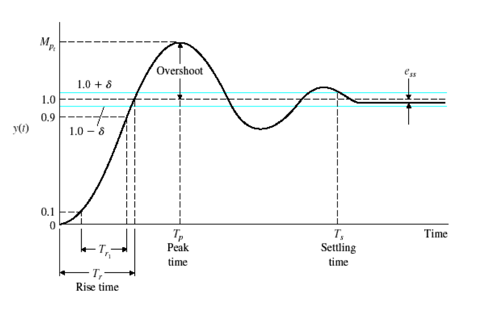

# Lab Assignment: Motion Control

In this exercise, you will add wall following functionality to your robot. As discussed in class, you will develop a "two-stage" controller: a higher-level controller to monitor the distance from a wall, which will command a lower-level controller for wheel speeds.

Individually, each team member will create a wheel speed controller. As a team, you will discuss each student's solution and commit one of them to your library. Your team will then implement wall following.

The skeleton code has a...well...skeleton state machine, which you will augment to manage the robot tasks. The demonstration for this week will be your robot driving "laps" indefinitely around the arena, stopping at each corner when it approaches the wall at the end of the run.

**You will be delivering your solutions through GitHub Classroom**. The entire lab exercise is contained in this repository and you will submit your solutions by committing them to GitHub. **Note that each team member will create a markdown file for answering questions along the way** (as opposed to a .pdf file or using Canvas). Go [here](https://javascript.plainenglish.io/github-markdown-cheat-sheet-everything-you-need-to-know-to-write-readme-md-ce40369da21f) for a cheat sheet on markdown. In particular, you may want to upload pictures from time to time -- it's not hard in markdown language.

> <span style="color:red">Deliverables are "quoted" and marked in red throughout this file.</span> **But note that the red only shows up when displayed in VSCode!** GitHub markdown does not support colored text.

The individual assignment is due prior your laboratory session, but the deadline is a **soft deadline**. Normally, you are expected to receive sign-offs for your individual assignment no later than the night before lab (note there is a class in Noiles on Wednesday mornings, so it is not practical to get a sign-off then), but we'll be flexible while we learn the ropes of GitHub Classroom. At the very least, you should put effort into the individual assignment so you can come to lab with good questions. Work out with your team how far you expect to be so that you're all in the same place when lab starts.

Git allows you to take snapshots of your code and reverse changes in case they do not work. Therefore it is important to make as many snapshots as necessary to work efficiently. Of course, Git loses its meaning when only refined code is being committed and pushed. **If you do all your work and then push it with a single commit, you risk earning a low grade.** Get in the habit of making a commit every time you make a significant change to your code.

We give example instructions for Git using the command line interface, but you're welcome to use the VSCode interface.

Background material has been placed in the `docs` folder in this repo:
- [Background for this lab](docs/lab02-background.pdf)
- [The Elements of Control](docs/elements%20of%20robotics%20chp%2006%20control.pdf), which provides another explanation.
- [An intro to state machines](docs/lab02.state-machines.pdf)

## Individual Assignment

For the individual assignment, you will create and tune a speed controller. In RBE 2001, the controller was provided for you -- though you may look at the library that was provided, you should only do so after a "productive struggle" to develop your own, especially since your controller will be structured a bit differently than the controller in 2001. In particular, the controller in RBE 2001 made use of a generic `PIDController` class, which can be reused for all sorts of controllers (wall following, move-to-point, etc.). Advanced programmers are welcome to borrow the class and implement it, but the more straightforward solution is to add control parameters to your motor class.

### Step 1: Clone this repository to your computer
Clone this repository to your local machine.
```
git clone <PASTE THE REPO ADDRESS HERE>
```
Open the repository that you just cloned in VSCode. 

### Step 2: Create a personal branch

Each group member will have to program their own version of a **speed controller**. Create your own branch from the remote group repository. As a branch name, use your first dash last name "first-last" (e.g., isaac-asimov). Use VSCode or the CLI:

```
git checkout -b "your-branch-name"
git branch
```

The terminal will confirm that you are in your own personal branch. 

### Step 3: Create a personal file in user folder

Each group member must create an `md` file and name the file after their first and last names. You can create the file and commit it through VSCode or use the command line interface (CLI) by opening a terminal and entering:
```
git pull
cd users
touch first-last.md
git add --all 
git commit -m "I added my user id and name file"
git push
```

You will use this file to answer questions in these instructions. 

> <span style="color:red"> Add a line of code to your markdown file:</span>

```
## This is my version of the assignment.
```
Now add, commit, and push the branch to your group repository:

```
git add -A
git commit -m "this is my own version of the git repository."
git push -u origin "your-branch-name"
```

Check your group's repository in a browser. You should be able to see the repository and a branch with your name (you may need to refresh the page).

### Step 3: Upload the `pid-motor-tuning` program to your Romi

Recall from the first lab activity that the `platformio.ini` file is not tracked in GitHub, since files are located in different places on different machines. You will need to copy an `ini` file from another project or create a new one. You'll also need to add the directory of the library files to your `lib_extra_dirs` list. In the end, you'll need to use code from last week's libraries as well as this week's.

Add a line to `platformio.ini` that reads,

```
build_flags = -D __MOTOR_DEBUG__
```

This line will tell the compiler to print the motor data to the Serial Monitor.

You will also need a timer class. You can use the one from `RBE 2001` or you can include the [EventTimer](https://github.com/gcl8a/event_timer) class that I use with,
```
lib_deps =
    https://github.com/gcl8a/event_timer
```

Or you can clone the repo to your local machine. Note that this timer does not automatically restart itself -- you need to call `EventTimer::restart()` if you want to have it run periodically or you can pass `true` to `checkExpired()`. See the code for more information.

Upload the code and open the Serial Monitor. The wheels will **not** rotate because there is no speed controller, but if you _gently_ turn them, you should see speed values output on the screen. If you press `Button A`, the target speed will toggle, but again, the wheels won't move.


### Step 4: Build a PI controller

The control function for the motor is buried rather deep in the code library. The `Chassis` class is used to manage the motors. `Chassis.cpp` contains two motor objects, `leftMotor` and `rightMotor`. The `LeftMotor` and `RightMotor` classes are derived from `Romi32U4Motor` because of the way the PWM is managed, but the key function here is `Romi32U4Motor::update()`, which is where you need to build your PI controller. See the comments therein for what you need to do.

Once you have built your PI controller, you can test it by running the `pid-motor-tuning` example again.

### Step 5: Tune the gains

Consult `serial_comm.h` to see how to change the gains and the target speed of the wheel (you can also press `Button A`, which toggles the target speed). Tune the gains until you are satisfied with the controller. [Satisfaction](https://www.youtube.com/watch?v=MSSxnv1_J2g) is a bit subjective, but you want the response to be as fast as reasonable. A little overshoot is OK, but you probably don't want huge overshoot. You may want to use the Serial _Plotter_ in Arduino (but note that you can't have both VSCode and the Serial Plotter talking to your Romi at the same time). You could also copy/paste the Serial output into a spreadsheet (USe `CTRL-C` to disable the Serial Monitor). Record the dynamic response to a *step input*. You may want to edit the code so that it prints `millis()` along with the motors speeds (but that will make the Serial Plotter output hard to read). 

> <span style="color:red"> Determine and record the response time and overshoot (if there is any) in your personal file you created above. Include a snapshot of the response profile, as shown below.</span>

The figure below shows some of the terminology used for control analysis. Specifically, we'll define `rise time` as the amount of time it takes to go from 5% to 95% of the step (`T_r1` in the figure).



Use your finger to put resistance on the wheel -- does the integral term compensate? Can you demonstrate *integral windup*? Did you cap the integral in your PID solution?

### Step 6: Convert velocities to encoder counts

To avoid lengthy calculations, the speeds of the *motors* are stored as "encoder ticks per interval"; `Chassis::setMotorTargetSpeeds()` takes arguments with those units. You will need to add a new method, `Chassis::setWheelTargetSpeeds()`, which takes *linear* speed (e.g. cm/sec) as an argument. The method will then convert cm/sec to ticks/interval, which means you'll need to find two things:

- the number of encoder ticks per cm (or cm/tick, whichever works better for you)
- the length of the control interval

For the former, you can do some research. For the latter, you can do an experiment:

- Uncomment the line at the end of `Chassis::init()`. Doing so will enable output on `pin 6`, which will now _toggle_ each time the timer rolls over. Unfortunately, `pin 6` is also connected to the buzzer, so you'll want to de-uncomment the line when you're done.
- Run the code and use the oscilloscope to measure the length of each pulse on `pin 6`.
- Alternatively, you can look in the [datasheet](https://ww1.microchip.com/downloads/en/DeviceDoc/Atmel-7766-8-bit-AVR-ATmega16U4-32U4_Datasheet.pdf) for the settings for `Timer4`, but sorting through the registers is non-trivial.

**Record the control loop period in your personal file.**

After you've written your conversion function, edit the main code to call the wheel speed method, as opposed to the motor speed method. Pass a value of 10 cm/sec to each of the wheels and test that your robot is driving the correct speed.

> <span style="color:red"> [INDIVIDUAL SIGN-OFF: PID Control] </span>

Be prepared to demonstrate performance, including integral windup. 

> <span style="color:red"> Create a release of your code in GitHub and call it: `pid-tuning-your-name` (e.g., `pid-tuning-lewin`). </span>

---

## Group Assignment

### Step 1: Discussion
As a group, discuss each of the solutions. What are the advantages and disadvantages of each implementation? Decide as a group which solution you'd like to use for the next steps. 

> <span style="color:red">Create a pull request from in the browser (see exemplarily image below).</span>
    


Each team member must review the changes and make comments or suggestions to the pull request. Once everyone agrees, accept the pull request and work as a group from your master branch. You will need to run,
```
git checkout master
```
and then fetch and pull changes from GitHub.

### Step 2: Create a wall following algorithm

Now, as a group, you need to program a wall following controller. Start a [live session](https://code.visualstudio.com/learn/collaboration/live-share) via Visual Studio Code, and ensure that all team members are present. When using live share and commiting code as a group, author attributions should be automatically added in the vscode 'Source Control' menu. If they do not show up (perform a test commit), add them manually (*We will not be able to tell who worked on each commit UNLESS you state so in the commit message. This is important for receiving full points for your individual contributions of the group assignment*).

Program your robot to follow a wall. We will discuss strategies in class, but note that you will want to make libraries for the SharpIR proximity sensor and perhaps the HC-SR04 that you used last term. Pointers will be given in class or lab to help you with that.

### Step 3: Program the Romi to stop when it reaches a blocking wall

Write a checker function (using proper event checking) to determine when you _approach_ a wall at the stopping distance. Handle the event by stopping the motors and entering the idle state.

Prepare **a group demonstration** and showcase your Romi to a SA. It should drive the length of the long wall and stop in the center of the last grid cell.

> <span style="color:red"> [GROUP SIGN-OFF: Wall Following] </span>

Be prepared to show your robot in action. How did you deal with the pillars?

---

### Step 4: Add turning

Here, you'll make your robot travel around the arena indefinitely: Drive along a wall, detect an end wall, turn, drive, etc.

For now, you will use dead-reckoning to execute a turn. Given a turning speed (of your choice), calculate how fast and how long the wheels need to move to turn your Romi 90 degrees.

Create a new state, `ROBOT_TURNING`, and enter this state instead of idling when you reach the wall. Start a timer. Add checker and handler functions for expiration of the timer. What state will you go into when your timer expires?

> <span style="color:red"> [GROUP SIGN-OFF: Laps] </span>

Be prepared to demonstrate your robot.

Once you have received the sign-off,

> <span style="color:red">create a release on GitHub and call it: `laps-your-group-name` (e.g., `laps-team-1`).</span>

---

## Well done!
